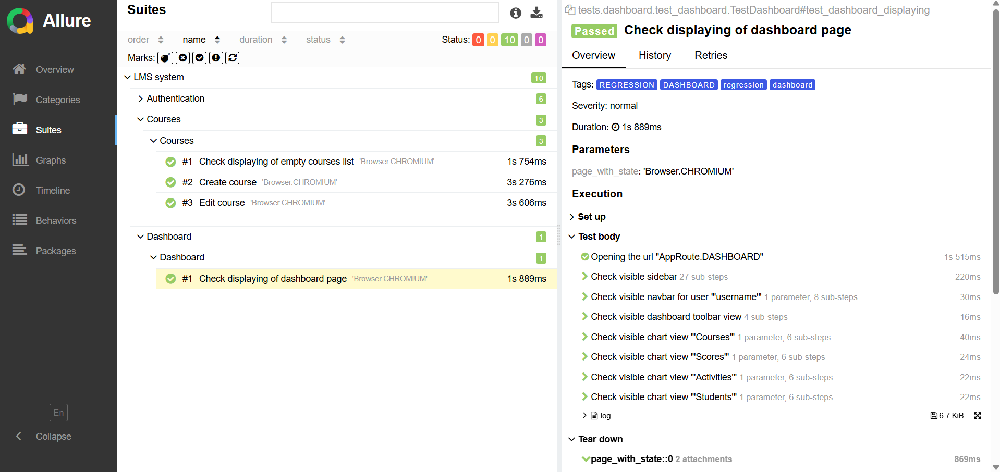

# UI Course Automation Tests

Этот проект реализует автоматизированные тесты для
[тестового приложения UI Course](https://nikita-filonov.github.io/qa-automation-engineer-ui-course/#/auth/login). Тесты написаны с
использованием `Python`, `Pytest`, `Allure` и `Playwright`. Исходный код тестируемого приложения доступен
на [GitHub](https://github.com/katinagon/autotests-ui).

## :clipboard: Описание проекта

Цель этого проекта — автоматизация тестирования приложения UI Course. Автоматизированные тесты проверяют различные
функции приложения, чтобы обеспечить его стабильность и корректность работы. Структура проекта следует лучшим практикам
организации тестового кода с понятными и поддерживаемыми скриптами.

## :arrow_forward: Команды для запуска

### Клонирование репозитория

Для начала работы склонируйте репозиторий проекта с помощью Git:

```bash
git clone https://github.com/katinagon/autotests-ui.git
cd autotests-ui
```

### Создание виртуального окружения

Рекомендуется использовать виртуальное окружение для управления зависимостями проекта. Следуйте инструкциям для вашей операционной системы:

#### Linux / MacOS

```bash
python3 -m venv venv
source venv/bin/activate
```

#### Windows

```bash
python -m venv venv
venv\Scripts\activate
```

### Установка зависимостей

После активации виртуального окружения установите зависимости проекта из файла `requirements.txt`:

```bash
pip install -r requirements.txt
```

### Дополнительная настройка Playwright (при необходимости)

Если вы запускаете Playwright впервые, вам может потребоваться установить необходимые браузеры:

```bash
playwright install
```

### Запуск тестов с генерацией Allure-отчета

Для запуска тестов и генерации Allure-отчета используйте следующую команду:

```bash
pytest -m "regression" --alluredir=./allure-results
```

Эта команда выполнит все тесты в проекте и отобразит результаты в терминале.

### Просмотр Allure-отчета

После выполнения тестов вы можете сгенерировать и просмотреть Allure-отчет с помощью команды:

```bash
allure serve allure-results
```

Эта команда откроет Allure-отчет в вашем браузере по умолчанию.

<p align="center">

</p>
